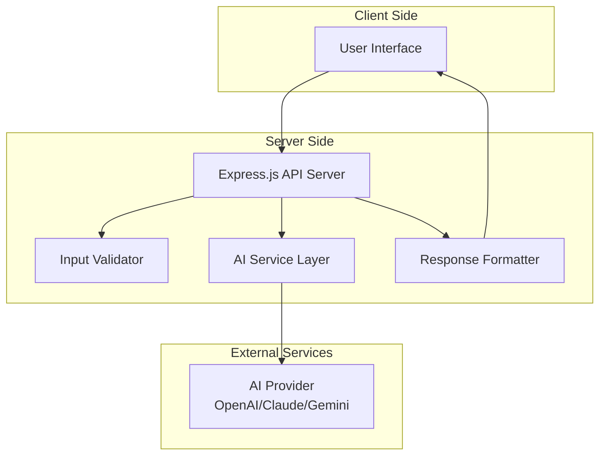

# Design Document: SmartLearn AI

## Overview

SmartLearn AI is a web-based AI-powered personalized learning assistant that helps students and beginner developers understand complex technical concepts through adaptive explanations. The system leverages generative AI to provide three distinct learning modes: beginner-level explanations, concise summaries, and quiz-based reinforcement.

The application follows a clean, stateless architecture with no data persistence, ensuring user privacy while delivering personalized educational content. The system integrates with external generative AI services to process user inputs (topics or code snippets) and generate appropriate educational responses based on the selected learning mode.

## Architecture

### High-Level Architecture



### System Components

The architecture follows a layered approach with clear separation of concerns:

1. **Presentation Layer**: Single-page web application with responsive design
2. **API Layer**: RESTful Express.js server handling requests and responses
3. **Business Logic Layer**: Input validation, AI service integration, and response formatting
4. **External Integration Layer**: Generative AI service communication

### Technology Stack

- **Frontend**: HTML5, CSS3, JavaScript (vanilla)
- **Backend**: Node.js with Express.js framework
- **AI Integration**: Configurable AI provider (OpenAI GPT, Anthropic Claude, or Google Gemini)
- **Architecture Pattern**: RESTful API with stateless design
- **Deployment**: Single-server deployment with environment-based configuration

## Components and Interfaces

### Core Components

#### 1. Web Server (Express.js Application)
- **Purpose**: Handle HTTP requests, route management, and middleware integration
- **Key Methods**:
  - `POST /api/explain` - Process learning requests
  - `GET /health` - Health check endpoint
- **Dependencies**: Express.js, CORS middleware, body parser

#### 2. Input Validator
- **Purpose**: Validate and sanitize user inputs before AI processing
- **Key Methods**:
  - `validateInput(text, mode)` - Validate input text and learning mode
  - `sanitizeInput(text)` - Clean and prepare input for AI processing
  - `checkContentSafety(text)` - Screen for inappropriate content
- **Validation Rules**:
  - Text length: 1-2000 characters
  - Learning mode: 'beginner', 'summary', or 'quiz'
  - Content safety screening

#### 3. AI Service Manager
- **Purpose**: Abstract AI provider interactions and manage API calls
- **Key Methods**:
  - `generateExplanation(input, mode)` - Generate educational content
  - `formatPrompt(input, mode)` - Create provider-specific prompts
  - `handleAPIResponse(response)` - Process and validate AI responses
- **Configuration**: Environment-based provider selection and API key management

#### 4. Response Formatter
- **Purpose**: Structure AI responses into consistent, user-friendly formats
- **Key Methods**:
  - `formatBeginnerExplanation(content)` - Structure detailed explanations
  - `formatSummary(content)` - Format concise summaries
  - `formatQuiz(content)` - Structure quiz questions and answers
  - `addMetadata(response)` - Include response metadata

#### 5. Error Handler
- **Purpose**: Centralized error handling and user-friendly error messages
- **Key Methods**:
  - `handleValidationError(error)` - Process input validation errors
  - `handleAIServiceError(error)` - Handle AI provider errors
  - `formatErrorResponse(error)` - Create consistent error responses

### Interface Definitions

#### API Request Interface
```javascript
{
  "input": "string (1-2000 chars)",
  "mode": "beginner" | "summary" | "quiz",
  "topic_type": "concept" | "code" // Optional, auto-detected
}
```

#### API Response Interface
```javascript
{
  "success": boolean,
  "data": {
    "explanation": "string",
    "examples": ["string"],
    "questions": [
      {
        "question": "string",
        "options": ["string"],
        "correct_answer": "string",
        "explanation": "string"
      }
    ],
    "mode": "string",
    "processing_time": "number"
  },
  "error": "string" // Only present if success is false
}
```

#### AI Provider Interface
```javascript
{
  "generateContent": async (prompt, options) => Promise<string>,
  "validateResponse": (response) => boolean,
  "handleRateLimit": (error) => Promise<void>
}
```

## Data Models

### Input Model
```javascript
class LearningRequest {
  constructor(input, mode, topicType = null) {
    this.input = input;           // User's topic or code snippet
    this.mode = mode;             // Learning mode selection
    this.topicType = topicType;   // Auto-detected or specified
    this.timestamp = new Date();  // Request timestamp
  }
  
  validate() {
    // Input validation logic
  }
  
  sanitize() {
    // Input sanitization logic
  }
}
```

### Response Model
```javascript
class LearningResponse {
  constructor(explanation, examples = [], questions = []) {
    this.explanation = explanation;  // Main educational content
    this.examples = examples;        // Code or conceptual examples
    this.questions = questions;      // Quiz questions (if applicable)
    this.metadata = {
      mode: null,
      processingTime: null,
      timestamp: new Date()
    };
  }
  
  addExample(example) {
    this.examples.push(example);
  }
  
  addQuestion(question) {
    this.questions.push(question);
  }
}
```

### Quiz Question Model
```javascript
class QuizQuestion {
  constructor(question, options, correctAnswer, explanation) {
    this.question = question;           // Question text
    this.options = options;             // Array of answer choices
    this.correctAnswer = correctAnswer; // Correct answer
    this.explanation = explanation;     // Why this answer is correct
  }
  
  validate() {
    // Ensure all required fields are present
    return this.question && this.options.length >= 2 && 
           this.correctAnswer && this.explanation;
  }
}
```

### AI Provider Configuration Model
```javascript
class AIProviderConfig {
  constructor(provider, apiKey, baseURL, model) {
    this.provider = provider;     // 'openai', 'claude', 'gemini'
    this.apiKey = apiKey;         // API authentication key
    this.baseURL = baseURL;       // Provider API endpoint
    this.model = model;           // Specific model to use
    this.timeout = 30000;         // Request timeout in ms
    this.maxRetries = 3;          // Retry attempts for failed requests
  }
}
```

### Error Model
```javascript
class SmartLearnError extends Error {
  constructor(message, type, statusCode = 500) {
    super(message);
    this.type = type;             // 'validation', 'ai_service', 'system'
    this.statusCode = statusCode; // HTTP status code
    this.timestamp = new Date();  // Error occurrence time
  }
}
```

## Correctness Properties

*A property is a characteristic or behavior that should hold true across all valid executions of a system—essentially, a formal statement about what the system should do. Properties serve as the bridge between human-readable specifications and machine-verifiable correctness guarantees.*

### Property-Based Testing Properties

Based on the prework analysis and property reflection, the following properties capture the essential correctness requirements:

**Property 1: Input Processing and Validation**
*For any* valid technical topic or code snippet within the character limit, the system should successfully process the input and generate appropriate educational content
**Validates: Requirements 1.1, 1.2, 1.4**

**Property 2: Invalid Input Rejection**
*For any* invalid input (empty, too long, or containing harmful content), the system should reject the input and return a helpful error message
**Validates: Requirements 1.3, 1.5, 6.4, 6.5**

**Property 3: Mode-Specific Content Generation**
*For any* valid input and learning mode combination, the system should generate content appropriate to the selected mode (beginner explanations for beginner mode, concise content for summary mode, questions for quiz mode)
**Validates: Requirements 3.1, 3.2, 3.3, 3.4, 3.5**

**Property 4: Code Explanation Structure**
*For any* code snippet input, the generated explanation should include line-by-line breakdowns and properly formatted code examples
**Validates: Requirements 2.3, 4.2, 4.5**

**Property 5: Example Generation**
*For any* concept explanation, the system should include at least one relevant example, with complex topics generating up to three examples
**Validates: Requirements 4.1, 4.4**

**Property 6: Quiz Question Completeness**
*For any* quiz mode request, generated questions should have 3-4 answer options, include the correct answer, and provide explanations
**Validates: Requirements 5.1, 5.3, 5.4, 5.5**

**Property 7: Data Privacy Compliance**
*For any* user interaction, the system should not store personal information, retain session data, or implement tracking mechanisms
**Validates: Requirements 7.1, 7.2, 7.3, 7.4**

**Property 8: AI Service Integration**
*For any* valid request, the system should successfully integrate with AI services and handle service failures gracefully with appropriate error messages
**Validates: Requirements 9.1, 9.2, 9.3, 9.4, 9.5**

**Property 9: UI Responsiveness**
*For any* user interaction requiring processing time, the system should display loading indicators and maintain responsive design across device types
**Validates: Requirements 8.4, 8.5**

## Error Handling

### Error Categories

The system implements comprehensive error handling across multiple categories:

#### 1. Input Validation Errors
- **Empty Input**: User submits blank or whitespace-only content
- **Length Violations**: Input exceeds 2000 character limit
- **Content Safety**: Input contains potentially harmful or inappropriate content
- **Invalid Mode**: Learning mode is not one of the supported options

#### 2. AI Service Errors
- **API Failures**: External AI service is unavailable or returns errors
- **Rate Limiting**: API rate limits exceeded
- **Timeout Errors**: AI service requests exceed configured timeout
- **Invalid Responses**: AI service returns malformed or incomplete responses

#### 3. System Errors
- **Configuration Errors**: Missing or invalid environment configuration
- **Network Errors**: Connectivity issues with external services
- **Resource Exhaustion**: Server resource limitations

### Error Response Format

All errors follow a consistent response structure:

```javascript
{
  "success": false,
  "error": {
    "type": "validation" | "ai_service" | "system",
    "message": "User-friendly error description",
    "code": "ERROR_CODE",
    "timestamp": "ISO 8601 timestamp"
  }
}
```

### Error Handling Strategies

#### Graceful Degradation
- When AI services are unavailable, provide informative error messages
- Implement retry logic with exponential backoff for transient failures
- Maintain system availability even when external dependencies fail

#### User Experience
- Provide clear, actionable error messages
- Avoid exposing technical details to end users
- Include suggestions for resolving common issues

#### Logging and Monitoring
- Log all errors with appropriate detail levels
- Monitor error rates and patterns for system health
- Implement alerting for critical system failures

## Testing Strategy

### Dual Testing Approach

The testing strategy employs both unit testing and property-based testing to ensure comprehensive coverage:

#### Unit Testing
Unit tests focus on specific examples, edge cases, and integration points:

- **Input Validation**: Test specific validation rules and edge cases
- **Error Handling**: Verify error responses for known failure scenarios  
- **API Integration**: Test specific AI provider interactions
- **Response Formatting**: Validate output structure and content formatting
- **Configuration Management**: Test environment setup and provider switching

#### Property-Based Testing
Property tests verify universal properties across randomized inputs using a JavaScript property-based testing library (fast-check):

- **Minimum 100 iterations** per property test to ensure thorough coverage
- Each property test references its corresponding design document property
- **Tag format**: `Feature: smartlearn-ai, Property {number}: {property_text}`
- Tests generate random valid and invalid inputs to verify system behavior
- Comprehensive input coverage through randomization catches edge cases

#### Testing Configuration

**Property-Based Testing Library**: fast-check (JavaScript/Node.js)
- Provides generators for strings, objects, and custom data types
- Supports shrinking to find minimal failing examples
- Integrates well with existing JavaScript testing frameworks

**Test Organization**:
- Unit tests in `tests/unit/` directory
- Property tests in `tests/property/` directory  
- Integration tests in `tests/integration/` directory
- Each test file corresponds to a specific component or feature

**Coverage Requirements**:
- Unit tests: Focus on specific examples and error conditions
- Property tests: Verify all correctness properties from design document
- Integration tests: Test end-to-end workflows and external service integration
- Combined coverage should address all acceptance criteria from requirements

#### Example Property Test Structure

```javascript
// Feature: smartlearn-ai, Property 1: Input Processing and Validation
test('valid inputs should be processed successfully', () => {
  fc.assert(fc.property(
    fc.string({ minLength: 1, maxLength: 2000 }),
    fc.constantFrom('beginner', 'summary', 'quiz'),
    async (input, mode) => {
      const response = await smartLearnSystem.processInput(input, mode);
      expect(response.success).toBe(true);
      expect(response.data).toBeDefined();
    }
  ), { numRuns: 100 });
});
```

This comprehensive testing approach ensures that SmartLearn AI maintains correctness across all supported inputs while providing specific validation for known edge cases and integration scenarios.